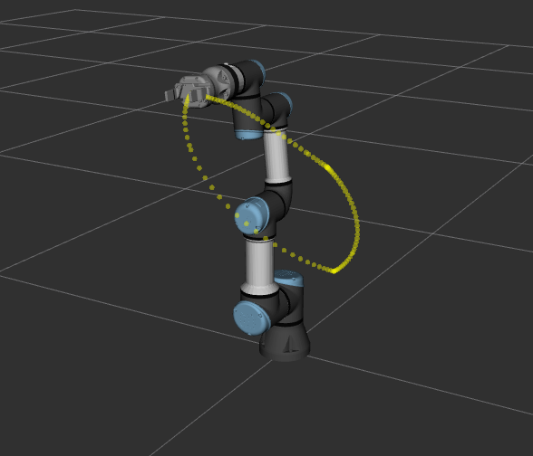

# ISCoin-simulator

||
|:--:|
|*Example trajectory visualization*|

## Setup

See [instructions](./.docker/README.md) to build or download the containerized `iscoin_simulator`.

## Simulate joint trajectories

Depending on hardware availability, run the container with `docker compose` and either the `gpu` or `cpu` argument

```bash
docker compose run --rm --name iscoin_simulator gpu|cpu
```

Inside the container, the UR3e simulator can be started from the terminal with

```bash
ros2 launch iscoin_simulation_gz iscoin_sim_control.launch.py
```

which will open the Gazebo Ignition display locally, on the host device. To send commands to the simulated robot, another terminal window is needed. This can be done by using a terminal multiplexer like `tmux` or by entering the running container through another terminal with

```bash
docker exec -it iscoin_simulator /bin/bash
```

As an example, run the following command from the new terminal window to simulate a demo trajectory:

```bash
ros2 run iscoin_driver demo.py
```

The trajectories to be simulated are saved as `json` in the `iscoin_driver/config` directory. Custom trajectories can be passed to the demo script in the following manner:

```bash
ros2 run iscoin_driver demo.py --ros-args -p traj:=<path-to>/custom_traj.json
```

To quit the simulator, close the window or use `CTRL+C` in the corresponding terminal.